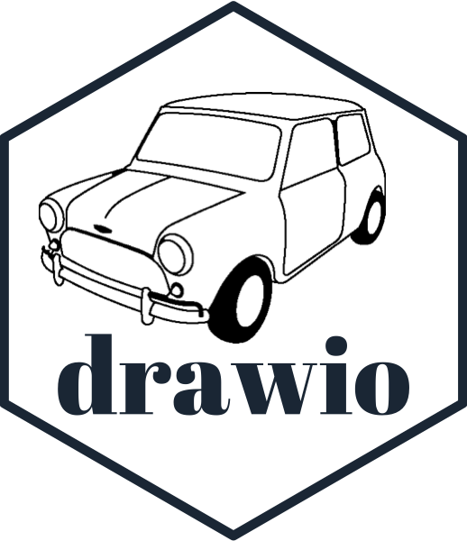
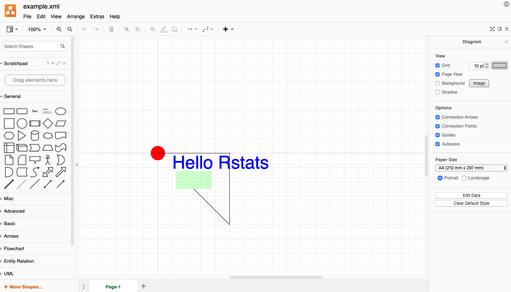
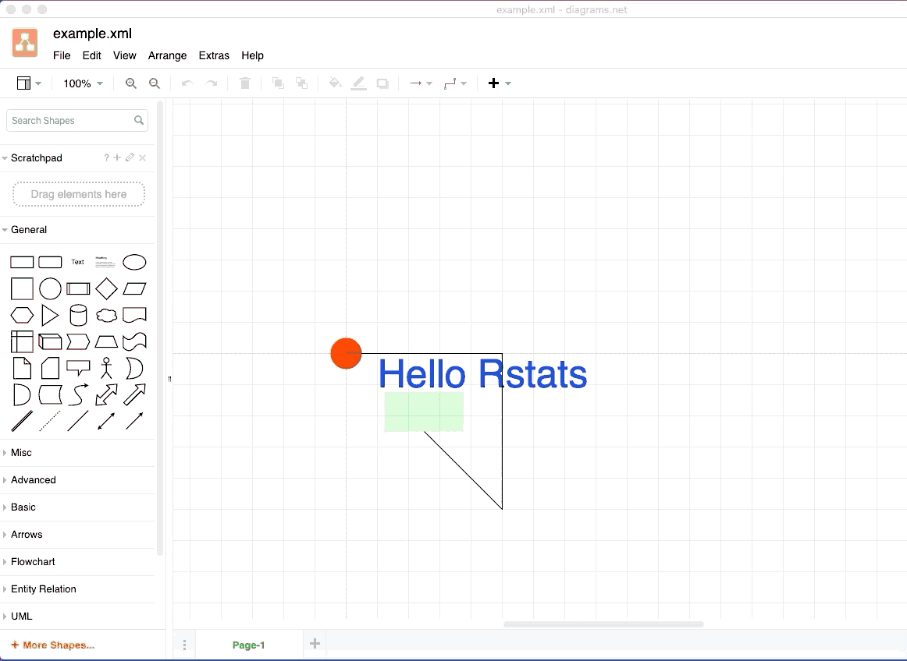

<!-- README.md is generated from README.Rmd. Please edit that file -->

```{r, include = FALSE}
knitr::opts_chunk$set(
  collapse = TRUE,
  comment = "#>",
  fig.path = "man/figures/README-",
  out.width = "100%"
)

library(minidrawio)
```


```{r echo = FALSE, eval = FALSE}
# Quick logo generation. Borrowed heavily from Nick Tierney's Syn logo process
library(magick)
library(showtext)
font_add_google("Abril Fatface", "gf")

```


```{r echo = FALSE, eval = FALSE}
img <- image_read("man/figures/mini-cooper-s.gif") %>%
  image_transparent(color = "#f9fafb", fuzz = 10) %>%
  image_trim() %>%
  image_threshold()


hexSticker::sticker(subplot  = img,
                    s_x      = 0.92,
                    s_y      = 1.2,
                    s_width  = 1.5,
                    s_height = 0.95,
                    package  = "drawio",
                    p_x      = 1,
                    p_y      = 0.6,
                    p_color  = "#223344",
                    p_family = "gf",
                    p_size   = 10,
                    h_size   = 1.2,
                    h_fill   = "#ffffff",
                    h_color  = "#223344",
                    filename = "man/figures/logo.png")

image_read("man/figures/logo.png")
```


# minidrawio   

<!-- badges: start -->


<!-- badges: end -->


#### `minidrawio` is a package for creating simple, single-page [draw.io](draw.io) documents.


[draw.io](draw.io) is a vector diagram format and a website for editing such diagrams.

`minidrawio` is an R package which allows you to create draw.io diagrams.

It's killer feature is that the [draw.io](draw.io) website is an interactive vector
diagram editor.   Any diagram you create with `minidrawio` can be uploaded 
to the site (for free!) and edited.


Currently, `minidrawio` is not a very complete implementation. Its initial purpose is to 
contain enough functionality to be able to use it as a graphics device backend.
([devoutdrawio](https://github.com/coolbutuseless/devoutdrawio) is coming soon!)


## Installation

You can install from [GitHub](https://github.com/coolbutuseless/minidrawio) with:

``` r
# install.packages("remotes")
remotes::install_github("coolbutuseless/minidrawio")
```

## Future possibilities

* Lots more documentation and examples
* Feature parity with what the [draw.io](draw.io) web interface offers.
    * e.g. be able to programatically add any of the library of shapes and 
      link them together correctly in a hierarchy.
    * text rotation, shadows, grid layouts, etc, etc. 


## Simple example of building a draw.io document

```{r}
#~~~~~~~~~~~~~~~~~~~~~~~~~~~~~~~~~~~~~~~~~~~~~~~~~~~~~~~~~~~~~~~~~~~~~~~~~~~~~~
# This is the basic setup needed for every drawio file
#~~~~~~~~~~~~~~~~~~~~~~~~~~~~~~~~~~~~~~~~~~~~~~~~~~~~~~~~~~~~~~~~~~~~~~~~~~~~~~
doc   <- DrawIODocument$new()
dia   <- doc$diagram(id = 'aaa')
graph <- dia$mxGraphModel()
root  <- graph$root()
root$mxCell(id = 0)
root$mxCell(id = 1, parent = 0)


#~~~~~~~~~~~~~~~~~~~~~~~~~~~~~~~~~~~~~~~~~~~~~~~~~~~~~~~~~~~~~~~~~~~~~~~~~~~~~~
# Now add some text and other elements
#~~~~~~~~~~~~~~~~~~~~~~~~~~~~~~~~~~~~~~~~~~~~~~~~~~~~~~~~~~~~~~~~~~~~~~~~~~~~~~
root$rect(x = 50, y = 50, width = 100, height = 50, size = 0, colour = NA, fill = 'green', alpha = 0.2)
root$text(x = 150, y = 50, colour = 'blue', text = "Hello Rstats", fontsize = 50)
root$line(x1 = 100, y1=100, x2=200, y2 = 200)
root$circle(0, 0, 20, fill = 'red')
root$polygon(c(0, 200, 200), c(0, 0, 200), fill = 'none')

#~~~~~~~~~~~~~~~~~~~~~~~~~~~~~~~~~~~~~~~~~~~~~~~~~~~~~~~~~~~~~~~~~~~~~~~~~~~~~~
# Save to drawio/XML format
#~~~~~~~~~~~~~~~~~~~~~~~~~~~~~~~~~~~~~~~~~~~~~~~~~~~~~~~~~~~~~~~~~~~~~~~~~~~~~~
doc$save("man/figures/example.xml")
```


You can <a href="man/figures/example.xml">download the xml</a>, or click the
link below to take you directly to the plot on [draw.io](draw.io)


```{r results='asis', echo=FALSE}
url <- readLines("man/figures/example.url")[[1]]
cat(paste0('<a href="', url, '">Click to view/edit the plot on draw.io</a>'), "\n\n")
```

#### Screenshot of plot in draw.io

```{r echo=FALSE}

```


# Edit in drawio

Now that the diagram is saved in drawio format, we can load it up in the drawio
web app and edit it to our heart's content!




