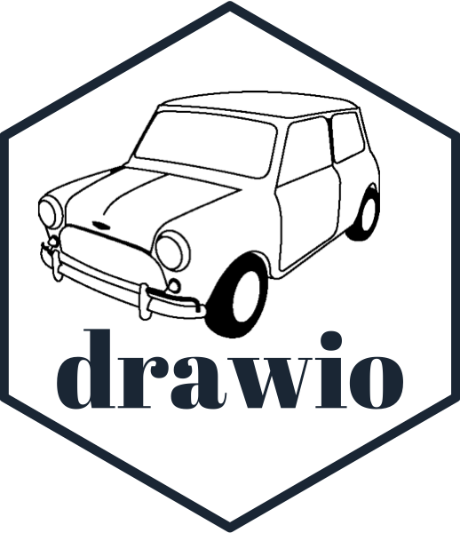
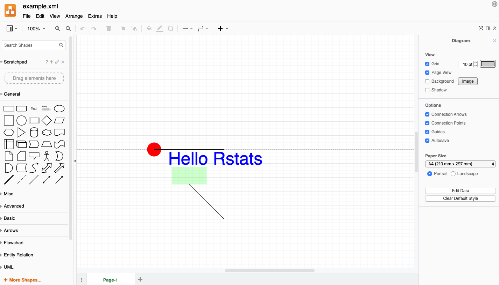

<!-- README.md is generated from README.Rmd. Please edit that file -->

# minidrawio 

<!-- badges: start -->


<!-- badges: end -->

#### `minidrawio` is a package for creating simple, single-page [draw.io](draw.io) documents.

[draw.io](draw.io) is a vector diagram format and a website for editing
such diagrams.

`minidrawio` is an R package which allows you to create draw.io
diagrams.

It’s killer feature is that the [draw.io](draw.io) website is an
interactive vector diagram editor. Any diagram you create with
`minidrawio` can be uploaded to the site (for free\!) and edited.

Currently, `minidrawio` is not a very complete implementation. Its
initial purpose is to contain enough functionality to be able to use it
as a graphics device backend.
([devoutdrawio](https://github.com/coolbutuseless/devoutdrawio) is
coming soon\!)

## Installation

You can install from
[GitHub](https://github.com/coolbutuseless/minidrawio) with:

``` r
# install.packages("remotes")
remotes::install_github("coolbutuseless/minidrawio")
```

## Future possibilities

  - Lots more documentation and examples
  - Feature parity with what the [draw.io](draw.io) web interface
    offers.
      - e.g. be able to programatically add any of the library of shapes
        and link them together correctly in a hierarchy.
      - text rotation, shadows, grid layouts, etc, etc.

## Simple example of building a draw.io document

``` r
#~~~~~~~~~~~~~~~~~~~~~~~~~~~~~~~~~~~~~~~~~~~~~~~~~~~~~~~~~~~~~~~~~~~~~~~~~~~~~~
# This is the basic setup needed for every drawio file
#~~~~~~~~~~~~~~~~~~~~~~~~~~~~~~~~~~~~~~~~~~~~~~~~~~~~~~~~~~~~~~~~~~~~~~~~~~~~~~
doc   <- DrawIODocument$new()
dia   <- doc$diagram(id = 'aaa')
graph <- dia$mxGraphModel()
root  <- graph$root()
root$mxCell(id = 0)
root$mxCell(id = 1, parent = 0)


#~~~~~~~~~~~~~~~~~~~~~~~~~~~~~~~~~~~~~~~~~~~~~~~~~~~~~~~~~~~~~~~~~~~~~~~~~~~~~~
# Now add some text and other elements
#~~~~~~~~~~~~~~~~~~~~~~~~~~~~~~~~~~~~~~~~~~~~~~~~~~~~~~~~~~~~~~~~~~~~~~~~~~~~~~
root$rect(x = 50, y = 50, width = 100, height = 50, size = 0, colour = NA, fill = 'green', alpha = 0.2)
root$text(x = 150, y = 50, colour = 'blue', text = "Hello Rstats", fontsize = 50)
root$line(x1 = 100, y1=100, x2=200, y2 = 200)
root$circle(0, 0, 20, fill = 'red')
root$polygon(c(0, 200, 200), c(0, 0, 200), fill = 'none')

#~~~~~~~~~~~~~~~~~~~~~~~~~~~~~~~~~~~~~~~~~~~~~~~~~~~~~~~~~~~~~~~~~~~~~~~~~~~~~~
# Save to drawio/XML format
#~~~~~~~~~~~~~~~~~~~~~~~~~~~~~~~~~~~~~~~~~~~~~~~~~~~~~~~~~~~~~~~~~~~~~~~~~~~~~~
doc$save("man/figures/example.xml")
```

You can <a href="man/figures/example.xml">download the xml</a>, or click
the link below to take you directly to the plot on [draw.io](draw.io)

<a href="https://app.diagrams.net?lightbox=1&highlight=0000ff&edit=_blank&layers=1&nav=1&title=example.xml#RtVZdd6IwEP01nt196Dl8%2BPlYUWq1VVvban1LSYR0I6EhAu6v30SCgNDWPcd9MrmZmTj3zkxomNY2uWEg8O4pRKRhaDBpmIOGYeidjil%2BJLJXSFfvpIjLMFRYDizwH6RATaE7DFFYMuSUEo6DMuhQ30cOL2GAMRqXzTaUlG8NgIsqwMIBpIouMeReinaNTo6PEHa97Ga93UtPtiAzVpmEHoA0LkDmsGFajFKerraJhYhkL%2BMl9bM%2FOT3%2BMYZ8fo4DZCDG9MpGzm72bA9S9wiQncpU%2FUu%2Bz1JndOdDJL21htmPPczRIgCOPI2F2gLz%2BJaInS6WG0yIRQllB19T02xbk24hZ%2FQ3yk586qMjmPEpzagIjLksEkNuq7mpdCPEOEoKkMr1BtEt4mwvTNRpS9G%2BL2%2FjXERdU5hXEDCzA6pu3GPgnFqxUOx%2BybTzekc%2F7JVdw3SbcMkZFdnJ0k3J%2BXHgTTInVm1XWoxEYCpMHkMOeJj5iftT19SoIpxgiJfVqVWhKJmCAMGuL7aO4B0JvC%2F5xqIbrtXBFkMor%2BkT8IbInIaYY1rrcXdiwKmsmHJNMSrSSo81xYeaAK1sb4MtJlJDQUWEZOTLlIf%2BfX20%2Fm95jEHI%2Fcnm8ftGRD68lqMs1%2BlTaVUJHVoPgtA7Up03mF7oy6wF9a9IRbA0IquUlnpKr5J2BBkiQu%2BoPFrrqFR3zCk%2BdEimmVbW7LjPQoR0xxykvIqj8CSQcRLIOA3EAXMRrwQ6KHtM%2FF%2FEjmLk4VmYnCE2IeJtOxEZhEH6uG1wIiU9d6yeTGU5k7W6arhAQ10ZZU6P%2B0J1NGs6qnm5jrpLxv5s7Sy%2FJ1m8xYFchhz5DiY%2FyYvVGYT3sTWPwZpFhmn5E097mFgA70ZPvtbboKnbMPrTpflGYWIOR%2B6st7zxXodrfTNuv97OR3Q1a%2FaTURzu9xToo%2F1gOqZrQ1%2B8v3jrVTyPAr5I3rf%2BMkk81oL9xXSom8%2FRbWh6z17PWU0%2F6GQ0jj6g9dQLlvxJh3b3JXCb%2FYG5b8%2BNHRAcPKwivzv49WXTV%2Fu6ZsxfUv6CvEbdg1rprTMEFtv8uyhtuvzz0hz%2BBQ%3D%3D">Click
to view/edit the plot on draw.io</a>

#### Screenshot of plot in draw.io



# Edit in drawio

Now that the diagram is saved in drawio format, we can load it up in the
drawio web app and edit it to our heart’s content\!


